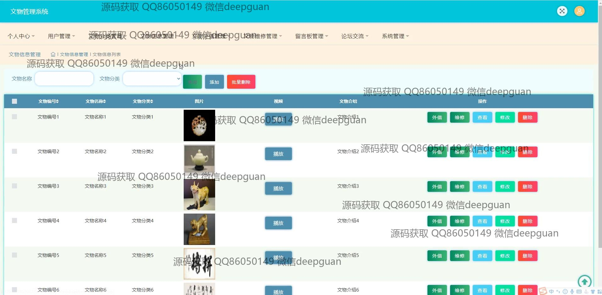

<h1 align="center">的文物管理系统</h1>

## 简介
文物管理系统：角色分为管理员、用户；支持文物分类、信息管理、外借、维修、用户管理、论坛交流、收藏管理、留言反馈等多功能操作。    --计算机毕业设计源码；毕设源码；java毕业设计源码

## 联系方式

<h3 align="center">获取完整代码与数据库文件 + 微信：deepguan QQ: 86050149 QQ群: 783742310</h3>

<h3 align="center">可帮忙远程部署 包运行成功！提供远程部署、修改代码、设计文档指导、代码讲解等服务！</h3>

## 功能介绍（完整见运行截图）
管理员：负责文物管理系统的全局操作，包括用户管理、文物分类管理、文物信息登记与修改、外借记录管理和维修记录管理。可在论坛模块进行内容审核和管理，支持文物外借、归还和维修的详细信息跟踪，提供统计报表及数据更新功能。通过个人中心可查看和编辑个人信息，并设置系统配置。

普通用户：可以进行注册、登录及退出操作，访问系统首页浏览文物推荐和资讯信息，通过搜索功能查询感兴趣的文物，查看文物的详细信息、相关图片和多媒体展示。在论坛模块参与交流，发布帖子或评论他人内容。通过个人中心查看收藏的文物或发布的内容，更新个人信息。

访客：可在首页浏览系统推荐的文物及文化资讯，查询公开的文物信息和简介，观看嵌入的视频资料。无法操作用户相关内容，如外借申请、评论互动或个人中心管理，需注册成为用户后使用完整功能。

借用单位：专注于外借管理模块，提交文物外借申请，填写外借事由及相关信息，包括借用单位、联系人和联系方式等，查看外借状态及记录。通过系统支持的多媒体功能上传必要的材料或信息，用于审核与记录。

## 运行截图

本代码来源于网络,仅供学习参考使用!

